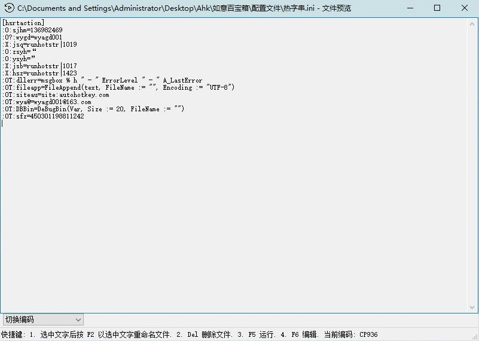

[返回主页](http://wyagd001.github.io/RuYi-Ahk)

#  如意百宝箱-Ahk 动作介绍

**动作编号**: 1070  
**动作名称**: 预览文件  
**动作作用的对象**: 选中文件  
**动作热键**: $Space  
**动作鼠标手势**: 无  
**动作说明**: 使用ahk预览选中的文件(文本, 图片, 压缩包...)  
**动作截图**:  
    
**动作内容**: 将选中文件路径作为参数, 执行外部脚本文件 "文件预览.ahk", 为 ATA 内置的动作  
**代码及详细解释**:  
在资源管理器窗口, 桌面, TC, Everything 窗口中, 按下快捷键 "空格" 就能使用 Autohotkey 预览当前选中的文件. 再次按下快捷键 "空格", 关闭预览窗口.  

支持的文件格式有:  
1. 文本文件: txt|ahk|bat|lrc|ini 等可在 "如一.ini" 配置文件的
[FilePrew] 段下的 text 条目添加其他文本格式的后缀扩展名.  
2. 音视频文件: mp3|mp4|wma|wmv 使用内嵌的 wmplayer 预览. 安装解码器后, 只要是 wmplayer 能播放的文件都能预览.  
3. 图片文件: png|jpg|gif 支持预览一些常见的图片格式  
4. 压缩包文件: rar|zip 利用自带的引用程序, 支持查看压缩包内的文件和压缩包备注信息.  
5. 办公文档表格: doc|docx|xls 支持简单的文本预览.  
6. pdf, md 和网页(htm, html): 使用内嵌的 IE 浏览器来预览文件.  
7. 文件夹 查看文件夹内的文件列表  
8. 桌面的回收站 查看回收站的文件列表, 能右键单个文件还原和清空回收站的操作  

对于文本文件和压缩包, 在预览时, 支持额外的快捷键:  
1. F2 重命名文件. 选中文字(文件) 后按 F2 以选中文字重命名文件  
2. Del 删除文件  
3. F5 打开运行  
4. F6 编辑  
