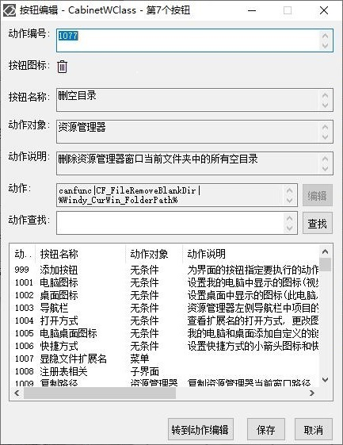
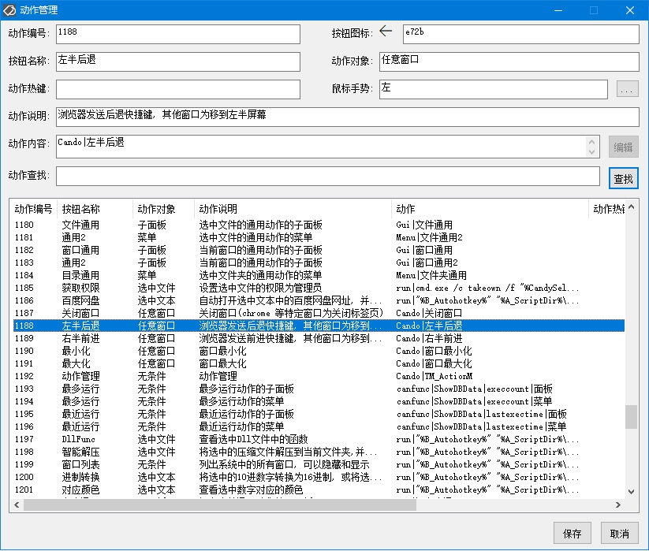

[返回主页](http://wyagd001.github.io)

#  如意百宝箱-Ahk 简介

**如意百宝箱-Ahk**: 如意百宝箱是一款针对不同窗口和选中文件显示一个定制的动作面板的快捷启动工具. 动作面板由热键或鼠标手势来显示, 然后点击动作按钮来执行动作, 也可以由单独的热键或鼠标手势直接执行动作. 软件可以自由新增动作(如改写内置动作, 添加外部 ahk 脚本).  

**脚本下载**: [https://wyagd001.github.io/RuYi-Ahk/RuYi.zip](https://wyagd001.github.io/RuYi-Ahk/RuYi.zip)  

**当前版本**: [2.4 - 2023/09/XX](history.md)

**最新发布**: [https://github.com/wyagd001/RuYi-Ahk](https://github.com/wyagd001/RuYi-Ahk)  

**关键词及目录**: AutoHotkey [快捷键与模式](#hotkey) [面板](#Board)  [动作](#Action)  [外部脚本](#Script)

### 功能介绍
如意百宝箱受到类似软件 Quicker, Ahk 的 Windy 和 Candy 脚本的影响, 是一款由 AutoHotkey 脚本语言编写的快速启动软件. 打开 "如一.exe" 即启动了程序, 然后在不同的窗口按下 Ctrl+Mbutton 即可显示定制的动作面板, 点击面板上的按钮来执行相应的动作, 也可以使用鼠标手势 "上右" 来显示主面板. 欢迎大家试用, 非常渴望倾听您的声音. 欢迎您的任何意见、建议、疑问、吐槽, 或者鼓励.  

#### 快捷键与模式
不同的快捷键对应不同的显示模式. 如意百宝箱的 3 组快捷键 Ctrl+Mbutton, Ctrl + 1, Alt + CapLocks 分别对应着面板, 菜单, 工具提示这 3 种模式. 热键可以在配置文件 "如一.ini" 中手动修改(重启程序后生效).  
- Ctrl+Mbutton 表示 Ctrl+鼠标中键, 可以右键托盘图标, 通过托盘菜单的 "热键管理\面板模式热键管理" 或 "如意设置\热键管理" 来修改为其他按键(不用重启程序, 直接生效). 按下热键后显示一个主面板, 主面板由上面的 12 个按钮(针对当前窗口) 和下面的 12 个按钮(针对选中的文字, 或文件, 由 Ctrl+C 获取) 组成, 其中每个按钮执行一个指定的动作.  
  - 下图是主面板图片  
    

- Ctrl + 1, 将面板模式转换为菜单模式, 按下后面板显示为菜单, 其中每个菜单执行对应着一个指定的动作, 该模式在针对当前窗口操作时容易获取到当前窗口. 可以通过托盘菜单的 "热键管理" 或 "如意设置" 来自定义该热键.  

- Alt + CapLocks 热键将面板模式转换为纯按键模式. 按下后将面板显示为工具提示, 工具提示中的每个项目通过按键(0-9, q-]) 来执行一个动作. 可以通过托盘菜单的 "热键管理" 或 "如意设置" 来修改为其他按键.  
  

- 额外的热键: 鼠标手势(仅上下左右四个方向)[\[1.5+\]](./history.md#1.5), 使用鼠标手势 "上右" 来显示主面板. 可以手动修改配置文件 "如一.ini", 或整体关闭鼠标手势, 但推荐通过托盘菜单的 "如意设置" 来自定义.  

#### 面板  
面板为动作的集合, 在按下上面的热键后显示, 点击面板上的按钮或菜单中的项目来执行相应的动作. 其配置文件为 "面板列表.ini", 定义了面板中按钮的顺序, 可以手动修改(重启程序后生效), 其配置形式为[面板名称], 其下条目 1=动作编号1, 2=动作编号2...  

  - 面板分为 3 种类型: 窗口进程名和窗口Class(例如, 资源管理器的 [explorer], [CabinetWClass], [Progman]), 选中文件的的扩展名(如 txt, 文件夹, 短文本, 长文本)和自定义名称. 前两种会根据优先级自动显示在主面板界面(按下热键后根据窗口类名和选中内容自动匹配), 后者多用于子面板(由主面板上的按钮来启动).  
     -  .1 主面板上部面板顺序(优先级): 当前窗口的进程名 > 当前窗口的窗口 Class > 窗口默认(当前窗口没有定义面板时显示)  
     -  .2 主面板下部面板顺序: 选中文件扩展名 > 文件默认 > 无选中  
     -  .3 选中文件扩展名包含的种类: 盘符, 文件夹, 多文件, 选中文件扩展名(如 txt), 短文本, 长文本
  - 下图为面板中的按钮编辑菜单, 可以左右移动按钮位置和删除按钮.  
  [\[2.3+\]](./history.md#2.3)鼠标可以拖拽按钮到其他按钮的位置, 实现两个按钮交换位置的效果.  
      

  - 下图为面板中的按钮编辑界面, 指定按钮的要执行动作的编号.  
      

#### 动作  
每个动作代表一个预设好的命令, 面板上的按钮对应一个动作, 点击面板上的按钮就会执行相应的动作. 动作设置保存在[\[1.1+\]](./history.md#1.1) "配置文件/内置动作.ini" 和 "配置文件/自定义动作.ini" 文件中.  
  -  [完整的内置动作列表](ActionList.md)  
  
  - 动作有以下 9 种类别: 运行(Run), 面板(Gui), 菜单(Menu), 发送按键(Key), 内置命令和函数(Cando 和 CanFunc), 使用指定程序打开选中文件(OpenWith), 设置剪贴板(SetClip), 对话框(Msgbox), 动作组合(CombActions).  
     - .1 运行: 运行程序, 打开文件(文件夹, 网址). 如打开C盘写为 "Run&#124;C:", 打开记事本写为 "Run&#124;notepad.exe". 要运行的外部 Ahk 脚本统一放在 "外部脚本" 目录.  
     - .2 面板: 在主面板上点击按钮后, 显示一个子面板. 动作写作 "Gui&#124;常用工具"  
     - .3 菜单: 在主面板上点击按钮后, 显示一个子面板中按钮的菜单. 动作写作 "Menu&#124;常用工具"  
     - .4 发送按键: 在当前窗口发送按键. 例: Keys&#124;^w  表示发送 Ctrl+w  
     - .5+6 内置命令和函数: 执行内置的 ahk 脚本标签和函数. 例: canfunc&#124;CF_FileRemoveBlankDir&#124;%Windy_CurWin_FolderPath% 其中 CF_FileRemoveBlankDir 为内置函数名称(删除指定文件夹下的空目录), %Windy_CurWin_FolderPath% 为函数的参数变量(资源管理器的当前窗口的目录)  
     - .7 使用指定程序打开选中文件. 例: openwith&#124;Notepad.exe 使用记事本打开选中的文件  
     - .8 设置剪贴板: 将剪贴板设为某个变量的值. 例: setclip&#124;%CandySel% 将选中文本或文件(的路径) 放入剪贴板  
     - .9 对话框: 测试用, 显示变量的值.  
     - .10 动作组合[\[2.4+\]](./history.md#2.4): 依次执行指定的多个动作  
     
  - 动作的管理由托盘菜单的 "[动作管理]((/Actions/1096.md))" 和面板按钮编辑界面的 "转到动作编辑" 按钮来启动.   
    动作管理界面可以编辑动作, 例如修改动作的图标, 名称, 针对的对象, 热键, 鼠标手势, 说明文本, 动作的命令. 也可以在这里创建新的动作(自定义动作编号 > 5000).  
        
  -  动作除了通过通过面板或菜单运行外, 还可以通过以下方式运行  
     -  .1 [\[1.5+\]](./history.md#1.5)动作可以设置单独的热键, 如 "^!a", 表示 Ctrl + Alt + a 热键来直接启动该动作  
     -  .2 [\[1.5+\]](./history.md#1.5)动作可以设置单独的鼠标手势(上下左右), 如 "左", 表示按下鼠标右键后向左拖, 默认配置是将窗口放到左半屏幕.  
     -  .3 [\[1.8+\]](./history.md#1.8)动作可以通过热字串来启动打开. 例: 默认的 "jsb" 来打开记事本  
     -  .4 [\[1.7+\]](./history.md#1.7)通过动作搜索界面来打开  
     -  .5 [\[1.7+\]](./history.md#1.7)设置动作悬浮为按钮, 可以通过点击单个动作的悬浮按钮来打开.  
     -  .6 [\[1.9+\]](./history.md#1.9)在如意运行时, 通过运行主程序加动作编号的方式, 如 "如一.exe 1017" 来打开指定动作  
     -  .7 [\[1.9+\]](./history.md#1.9)如意固定到任务栏, 通过任务栏按钮菜单点击菜单项目打开最近的某个动作(可固定动作)(启动方式同 6)  
     -  .8 [\[2.0+\]](./history.md#2.0)设置跟随或定时动作, 启动如意时自动打开或定时打开  
     -  .9 [\[2.1+\]](./history.md#2.1)设置[文件右键菜单](./Actions/1342.md),  通过资源管理器中文件的右键菜单打开(启动方式同 6, 但是带有文件路径参数)  
     -  .10 [\[2.3+\]](./history.md#2.3)设置动作到托盘按钮, 通过点击托盘按钮来打开  
     -  .11 [\[2.1+\]](./history.md#2.1)通过[网页](http://127.0.0.1:5151)(运行着如意的电脑浏览器打开链接)来打开执行动作(任意窗口和无条件的动作)  
     
#### 外部脚本
  - 许多动作是由外部的 ahk 脚本来完成的, 它们统一放在 "外部脚本" 目录. 现在内置的外部动作脚本有 198 个.  
    下面列出了内置的外部脚本动作, 第二列为外部动作脚本是否集成在 AnyToAhk.exe(ATA) 中.  

| 动作编号 | ATA内置 | 按钮名称 | 动作对象 | 描述 | 脚本名称 |
| ----------- | ----------- | ----------- | ----------- | ----------- | ----------- |
|1001|否|电脑图标|无条件|设置我的电脑中显示的图标(视频, 图片等六个文件夹..)|此电脑图标设置.ahk|
|1002|否|桌面图标|无条件|设置桌面中显示的图标(此电脑, 回收站, 网络..)|桌面图标设置.ahk|
|1003|否|导航栏|无条件|资源管理器左侧导航栏中项目的设置(收藏夹, 库, 快速启动..)|导航栏项目设置.ahk|
|1004|否|打开方式|无条件|查看扩展名的打开方式, 更改图标|文件打开方式查看.ahk|
|1005|否|电脑桌面图标|无条件|我的电脑和桌面添加自定义的链接图标|我的电脑和桌面添加特殊链接.ahk|
|1006|否|快捷方式|无条件|设置快捷方式的小箭头图标和快捷方式字样|快捷方式箭头图标设置.ahk|
|1033|是|水平最大化|任意窗口|水平最大化|窗口移动.ahk|
|1034|是|垂直最大化|任意窗口|垂直最大化|窗口移动.ahk|
|1036|是|文件改名|选中文件|修改选中的文本文件的名称和扩展名|文件名修改.ahk|
|1037|是|[打开选中](/Actions/1037.md)|选中对象|运行选中的文本(路径(程序, 文件, 目录), 网址, 注册表地址)|运行选中的文本.ahk|
|1038|否|[编辑链接](/Actions/1038.md)|选中文件|编辑选中的lnk快捷方式文件|LnkEditor.ahk|
|1039|是|放入同名|选中文件|将选中的文件放入同名的文件夹中(自动创建目录)|放入同名文件夹.ahk|
|1040|是|解散目录|选中文件|将选中文件夹中的文件移动到当前目录后, 删除选中文件夹|解散文件夹.ahk|
|1042|是|C:\ |资源管理器|在当前资源管理器窗口打开动作中指定的目录 C:\ |当前窗口打开.ahk|
|1044|是|[转码](/Actions/1044.md)|选中文件|将选中的文本文件转换编码|文本文件转码.ahk|
|1045|是|创建软硬链接|选中文件|为选中的文件创建软硬链接|文件创建软硬链接.ahk|
|1046|是|文件属性|选中文件|修改选中的文件的属性(系统, 隐藏, 修改时间等)|文件属性.ahk|
|1061|是|[文档所在目录](/Actions/1061.md)|特定窗口|使用资源管理器以新窗口方式打开窗口编辑的文件所在的目录|打开的文件.ahk|
|1063|是|编辑模式|Chrome|Chrome 浏览器开启网页编辑模式|Chrome地址栏打开.ahk|
|1064|是|!编辑模式|Chrome|Chrome 浏览器关闭网页编辑模式|Chrome地址栏打开.ahk|
|1065|是|强制复制|Chrome|Chrome 浏览器强制打开网页的右键复制功能|Chrome地址栏打开.ahk|
|1067|是|合并文件|选中文件|将选中的多个文本文件合并为一个文件|合并文本文件.ahk|
|1070|是|[预览文件](/Actions/1070.md)|选中文件|使用ahk预览选中的文件(文本, 图片, 压缩包...)|文件预览.ahk|
|1071|是|打开方式|选中文件|弹出选中文件的打开方式菜单|文件打开方式.ahk|
|1076|是|隐藏图标|无条件|隐藏或恢复桌面图标|隐藏桌面所有图标.ahk|
|1080|是|MD5|选中文件|计算选中文件的MD5值|MD5_File.ahk|
|1081|是|交换文件名|选中文件|将当前选中的两个文件交换文件名|两个文件交换文件名.ahk|
|1086|是|[复制到Music](/Actions/1086.md)|选中文件|复制选中的文件到动作中指定的目录|复制文件到指定文件夹.ahk|
|1087|是|[同步文件夹](/Actions/1087.md)|资源管理器|左侧文件夹同步到右侧(左→右)|打开的文件夹同步.ahk|
|1089|是|[同步如意](/Actions/1087.md)|无条件|左侧文件夹同步到右侧(左→右)|打开的文件夹同步.ahk|
|1092|是|[查看编码](/Actions/1092.md)|选中文本|查看选中文本的编码|查看字符编码.ahk|
|1093|否|搜索文件夹|资源管理器|使用文件名搜索资源管理器窗口当前文件夹中的文件|文件夹中搜索文件.ahk|
|1094|否|IP设置|无条件|网络适配器的IP设置|网络连接IP设置.ahk|
|1095|否|Hash|选中文件|计算选中文件的Hash值|HashCalc.ahk|
|1096|否|[搜索文件内容](/Actions/1096.md)|资源管理器|搜索资源管理器窗口当前文件夹中文本文件中的内容|文本文件中查找字符.ahk|
|1097|是|百度搜索|选中文本|百度搜索选中文本|当前浏览器打开.ahk|
|1098|是|[文本比较1](/Actions/1098.md)|选中对象|将选中对象放入文本对比的左侧界面|文本比较.ahk|
|1099|否|自定义运行|无条件|自定义注册表中注册的exe文件|自定义运行命令.ahk|
|1101|是|[MD5对比1](/Actions/1101.md)|选中文件|将选中文件放入MD5计算界面的上部编辑框|MD5.ahk|
|1103|是|Hash2|选中文件|计算选中文件的Hash值|Hash_File.ahk|
|1104|是|缩小50%|选中文件|将选中的图形文件尺寸缩小50%|图像缩小一半.ahk|
|1105|是|灰度图像|选中文件|将选中的图形文件转换为灰度图像|图像变灰度.ahk|
|1106|是|放入剪贴板|选中文件|将选中的图形文件内容放入剪贴板|图像内容放入剪贴板.ahk|
|1107|是|品质压缩|选中文件|将选中的图形文件品质缩小50%|图像质量压缩一半.ahk|
|1108|是|[移动到Music](/Actions/1108.md)|选中文件|移动选中的文件到动作中指定的目录|移动文件到指定文件夹.ahk|
|1109|是|发送到打开的|选中文件|复制/移动选中文件到当前打开的目录|选中文件到打开的文件夹.ahk|
|1110|是|搜索帮助|选中文本|打开 ahk 中文帮助文件并跳转到选中的文本|Ahk脚本查帮助.ahk|
|1111|是|搜索v2帮助|选中文本|打开 ahkv2 中文帮助文件并跳转到选中的文本|Ahk2脚本查帮助.ahk|
|1112|是|有道翻译|选中文本|使用有道翻译选中的文本(官网已停用免费API)|有道翻译.ahk|
|1115|是|显示隐藏|无条件|资源管理器显示隐藏文件|显示隐藏文件.ahk|
|1116|是|隐藏文件|无条件|资源管理器隐藏文件|不显示隐藏文件.ahk|
|1117|是|显示扩展名|无条件|资源管理器显示文件的扩展名|显示扩展名.ahk|
|1118|是|隐藏扩展名|无条件|资源管理器隐藏文件的扩展名|不显示扩展名.ahk|
|1119|是|多文件名|选中文件|将选中的多个文件的文件名放入剪贴板|多文件仅复制文件名.ahk|
|1120|是|剪贴板至文件|资源管理器|剪贴板保存为文件到当前文件夹|剪贴板保存为文件到当前文件夹.ahk|
|1121|是|最近打开|特定窗口|显示系统最近打开的文档的菜单|最近使用的文档.ahk|
|1125|是|窗口静音|任意窗口|任意窗口静音, 再次运行恢复|窗口静音.ahk|
|1126|是|[浏览器打开](/Actions/1126.md)|特定窗口|使用(当前打开的)浏览器打开当前窗口打开的文本文件|其他编辑器打开.ahk|
|1129|是|记事本|特定窗口|使用记事本编辑当前窗口打开的文本文件|其他编辑器打开.ahk|
|1130|是|恐龙彩蛋|Chrome|Chrome 浏览器断网时的恐龙游戏彩蛋|Chrome地址栏打开.ahk|
|1131|是|Chrome URLs|Chrome|Chrome 浏览器的各种 URLs|Chrome地址栏打开.ahk|
|1141|是|复制网址|Chrome|获取 Chrome 浏览器地址栏的网址|GetBrowserURL.ahk|
|1142|是|复制全部网址|Chrome|获取 Chrome 浏览器所有打开标签页的网址|GetBrowserURL.ahk|
|1143|是|IE浏览器打开|Chrome|使用IE浏览器打开 Chrome 浏览器当前标签页的网址|其他浏览器打开.ahk|
|1145|是|Chrome 设置|Chrome|打开 Chrome 浏览器的设置页面|Chrome地址栏打开.ahk|
|1151|是|复制命令行|当前窗口|复制窗口进程命令行到剪贴板|复制窗口命令行.ahk|
|1152|是|Bing搜索|选中文本|Bing搜索选中文本|当前浏览器打开.ahk|
|1153|是|Baidu/Bing|Chrome|百度 Bing切换|百度Bing切换.ahk|
|1154|是|京东搜索|选中文本|京东搜索选中文本|当前浏览器打开.ahk|
|1156|是|B站搜索|选中文本|B站搜索选中文本|当前浏览器打开.ahk|
|1161|是|开机启动项目|注册表|在注册表窗口打开动作中指定的路径|注册表定位.ahk|
|1162|是|系统服务|注册表|在注册表窗口打开动作中指定的路径|注册表定位.ahk|
|1169|是|复制路径|注册表|复制注册表窗口打开的路径到剪切板|注册表定位.ahk|
|1171|是|截取窗口|任意窗口|截取窗口并存入脚本所在目录的截图目录中(客户区域不带窗口标题栏)|截图.ahk|
|1172|是|截取屏幕|无条件|截取显示器屏幕并存入脚本所在目录的截图目录中|截图.ahk|
|1173|是|二维码|选中文本|选中文字生成二维码|生成二维码.ahk|
|1174|是|更改盘符|选中驱动器|更改选中驱动器的盘符|磁盘_更改盘符.ahk|
|1175|是|序列号|选中驱动器|读取选中驱动器的序列号|磁盘_读取序列号.ahk|
|1176|是|AppId|任意窗口|更改窗口的AppId, 将窗口从当前任务栏分组中移除|更改appid.ahk|
|1177|是|FolderMenu|选中文件夹|将选中文件夹以菜单形式显示(以文件夹中的文件创建一个右键菜单)|FolderMenu.ahk|
|1178|是|FolderMenu|资源管理器|将资源管理器当前打开的文件夹以菜单形式显示|FolderMenu.ahk|
|1186|是|百度网盘|选中文本|自动打开选中文本中的百度网盘网址, 并将提取码放入剪贴板和自动填写|百度网盘链接.ahk|
|1197|是|DllFunc|选中文件|查看选中Dll文件中的函数|Dll文件中的函数.ahk|
|1198|是|[智能解压](/Actions/1198.md)|选中文件|将选中的压缩文件解压到当前文件夹, 并且只有一层文件夹|压缩文件智能解压.ahk|
|1199|否|窗口列表|无条件|列出系统中的所有窗口, 可以隐藏和显示|窗口_显示或隐藏.ahk|
|1200|是|进制转换|选中文本|将选中的10进数字转换为16进制, 或相反|数字_十进制十六进制转换.ahk|
|1201|是|[对应颜色](/Actions/1201.md)|选中文本|查看选中数字对应的颜色|数字_查看代码对应的颜色.ahk|
|1205|是|Ex图标|选中文件|将选中exe文件的图标设为所在文件夹的图标|Exe图标设为文件夹图标.ahk|
|1206|是|还原图标|选中文件夹|将选中文件夹的图标还原为默认的图标|Exe图标设为文件夹图标.ahk|
|1207|是|提取图标|选中文件|提取选中文件(exe, dll)中的图标|提取图标.ahk|
|1208|是|关联图标|选中文件|保存选中文件关联的图标到文件所在文件夹|关联图标存为png文件.ahk|
|1210|是|完整歌单|Chrome|Chrome 浏览器开启网页端网易云的完整歌单|Chrome地址栏打开.ahk|
|1211|是|下一页|Chrome|Chrome 浏览器自动下一页|Chrome地址栏打开.ahk|
|1212|是|[Ini_Fav](/Actions/1212.md)|选中文件|Ini 文件式的收藏夹菜单|Ini_收藏夹菜单.ahk|
|1213|是|[Ini_Opw](/Actions/1213.md)|选中文件|Ini 文件显示为程序菜单, 使用菜单中的程序打开选中的文件|Ini_程序打开选中文件.ahk|
|1214|是|百度搜索|选中文件|百度搜索选中文件的文件名|发送文件到手机目录.ahk|
|1217|是|到手机|无条件|同步电脑文件夹到手机文件夹(参数指定文件夹)|同步文件夹到手机.ahk|
|1219|是|到手机|选中文件|发送电脑选中文件到手机的根目录|发送文件到手机目录.ahk|
|1220|是|放入剪贴板|选中文件|将选中的文本文件内容放入剪贴板|文本文件内容放入剪贴板.ahk|
|1222|否|360收藏夹|无条件|将 360 浏览器的收藏夹显示为菜单|360浏览器收藏夹.ahk|
|1223|是|Chrome收藏夹|无条件|将 Chrome 浏览器的收藏夹显示为菜单|Chrome收藏夹.ahk|
|1224|是|Edge收藏夹|无条件|将 Edge 浏览器的收藏夹显示为菜单|MsEdge收藏夹.ahk|
|1225|否|文件库搜索|选中文件|使用文件名搜索文件库中的文件|数据库_文件库中搜索文件.ahk|
|1226|是|打开目录|对话框|显示一个菜单, 对话框跳转到选择的项目|对话框_打开目录.ahk|
|1228|是|搜狗翻译|选中文本|使用搜狗翻译选中的文本|搜狗翻译.ahk|
|1229|否|[查找重复](/Actions/1229.md)|选中文件夹|查找选中文件夹中的重复文件|查找重复文件.ahk|
|1231|否|环境变量|无条件|环境变量编辑备份脚本|环境变量.ahk|
|1232|是|新增Path|资源管理器|将资源管理器当前打开的路径加入环境变量 Path 中|Environment.ahk|
|1238|是|前后交换|选中文件|重命名文件, 将文件名使用分隔符分为前后两部分,然后交换其位置|文件名前后交换.ahk|
|1239|否|收藏夹|对话框|对话框跳转到ini文件中预设的文件夹|对话框_打开目录.ahk|
|1242|否|[文本处理](/Actions/1242.md)|选中文本|编辑选中的文本|文本处理.ahk|
|1249|是|文件夹结构|选中文件夹|将选中文件夹的结构复制到当前文件夹(仅复制选中文件夹及其下的子文件夹)|复制文件夹结构到当前目录.ahk|
|1250|是|结构+空文件|选中文件夹|将选中文件夹的结构和空白文件复制到当前文件夹|复制文件夹结构到当前目录.ahk|
|1259|否|窗口微缩0.5|任意窗口|隐藏窗口后以动态缩略图方式显示(原窗口的0.5)|窗口微缩.ahk|
|1262|否|Adb 命令|无条件|使用界面执行预设的 Adb 命令|Adb.ahk|
|1268|否|文件临时共享|选中文件|将选中文件共享到局域网, 局域网内的手机和电脑使用浏览器打开网址, 或手机扫码下载文件|文件临时共享.ahk|
|1269|是|[Zip压缩](/Actions/1269.md)|选中文件|将选中的文件添加到 Zip 压缩包中(引用程序内置)|7zip压缩.ahk|
|1270|是|[Zip解压](/Actions/1270.md)|选中文件|将选中的 Zip 文件自动解压到压缩包所在文件夹(引用程序内置)|7zip智能解压.ahk|
|1271|是|[Rar解压](/Actions/1271.md)|选中文件|将选中的 Rar 文件自动解压到压缩包所在文件夹(引用程序内置)|UnRar.ahk|
|1296|是|时间戳|选中文本|选中的文本进行时间戳和日期时间的互相转换|数字_时间戳转换.ahk|
|1297|是|文件列表|选中文件夹|显示选中文件夹中的所有文件的路径列表(整合版)|文件夹_文件列表(整合版).ahk|
|1298|是|文件列表|选中文件夹|显示选中文件夹中的所有文件的路径列表(按 Ahk 遍历顺序)|文件夹_文件列表.ahk|
|1299|是|文件列表|选中文件夹|显示选中文件夹中的所有文件的路径列表(按创建时间降序)|文件夹_文件列表(按创建时间降序).ahk|
|1300|是|文件列表|选中文件夹|显示选中文件夹中的所有文件的路径列表(按最近修改时间降序)|文件夹_文件列表(按最近修改时间降序).ahk|
|1301|是|文件列表|选中文件夹|显示选中文件夹中的所有文件的路径列表(按文件大小降序)|文件夹_文件列表(按文件大小降序).ahk|
|1302|否|复制信息|选中文件|将资源管理器选中文件各列显示的信息复制到剪贴板|复制资源管理器各列的信息.ahk|
|1303|否|ADS管理|选中文件夹|列出选中文件夹中带有ADS数据的文件, 并可以对ADS数据进行管理(新建, 删除, 另存为)|管理文件ADS.ahk|
|1304|是|添加 ADS|选中文件|为选中的文件添加文本的 ADS 流(流名称为 ADS1, ADS2)|添加文本到 ADS 流.ahk|
|1305|是|HTML转文本|剪贴板|将剪贴板中的 HTML 源代码去掉标签转换为纯文本后粘贴|剪贴板中源代码转纯文本后粘贴.ahk|
|1306|是|文本转HTML|剪贴板|将剪贴板中的 HTML 源代码转换为 HTML 后粘贴|剪贴板中源代码转html后粘贴.ahk|
|1307|是|[中英符号](/Actions/1307.md)|选中文本|选中的标点符号中英互转(没选中时光标在标点后也可以进行转换)|中英文符号转换.ahk|
|1308|否|粘贴All|ET|将当前选中的单元格内容复制到所有以数字为名称的工作表的相同位置|ET_当前单元格内容复制到所有数字名称的工作表相同位置.ahk|
|1309|否|软链接管理|选中文件夹|列出选中文件夹的软链接文件和文件夹|管理文件软链接.ahk|
|1310|否|硬链接管理|选中文件夹|列出选中文件夹的硬链接文件和文件夹|管理文件硬链接.ahk|
|1311|是|软硬链接检查|选中文件|检查选中文件是否存在硬链接文件, 或是否是软链接文件及显示其目标文件|文件软硬链接检查.ahk|
|1312|否|列宽All|ET|所有以数字为名称的工作表的相同列的宽度设置为当前选中的单元格的列宽|ET_所有数字名称的工作表相同列设置当前单元格列宽.ahk|
|1314|否|水平对齐|ET|将当前选中的单元格对齐方式复制到所有以数字为名称的工作表的相同位置的单元格中|ET_当前单元格水平对齐方式复制到所有数字名称的工作表相同位置.ahk|
|1316|否|[管理编码](/Actions/1316.md)|选中文件夹|列出选中文件夹中文本文件编码, 批量转码|管理文本文件编码.ahk|
|1317|是|[Ini_Fav](/Actions/1317.md)|无条件|Ini 文件显示为Gui面板(作为收藏夹使用)|Ini_收藏夹界面.ahk|
|1318|否|插入列|ET|所有以数字为名称的工作表的相同位置的右侧插入一列|ET_数字名称的工作表相同位置右边批量插入一列.ahk|
|1319|否|删除列|ET|所有以数字为名称的工作表批量删除选中列|ET_数字名称的工作表批量删除选中列.ahk|
|1325|是|关闭其他|任意窗口|关闭除当前窗口外的同进程名的所有其他窗口(拥有标题栏和最大化按钮的窗口)|关闭同进程所有其他窗口.ahk|
|1326|是|关闭其他|任意窗口|关闭除当前窗口外的所有其他窗口(只包括任务上可见的活动窗口)|关闭所有其他窗口.ahk|
|1327|是|[Bing壁纸](/Actions/1327.md)|无条件|将Bing背景图片设置为桌面壁纸|Bing壁纸.ahk|
|1328|是|壁纸路径|无条件|获取桌面壁纸的文件路径|壁纸路径.ahk|
|1329|否|整点敲钟|无条件|整点半点敲钟|时间_整点半点敲钟.ahk|
|1330|否|节日提醒|无条件|节日提醒|时间_节日提醒.ahk|
|1331|是|设为壁纸|选中文件|将选中图片文件设置为桌面壁纸|文件_设置壁纸.ahk|
|1332|是|随机壁纸|无条件|将下载Bing背景图片的随机缓存文件设置为桌面壁纸|将指定文件设为壁纸.ahk|
|1333|否|[文本批量](/Actions/1333.md)|选中文件夹|对文件夹中文本文件进行批量操作(替换, 开头(/结尾)新增(/删除)一行)|文本文件批量操作.ahk|
|1334|否|重启以太网|无条件|禁用以太网后重新启用(Win7 中显示为本地连接)|禁用启用网络连接.ahk|
|1335|否|重启以太网|无条件|禁用以太网后重新启用(Win7 中显示为本地连接)|禁用启用网络连接2.ahk|
|1336|是|Base64解|选中文本|将选中的Base64文本解密, 显示加密前的文本|Base64解密.ahk|
|1337|是|Base64加|选中文本|将选中的文本进行Base64加密|Base64加密.ahk|
|1338|是|Base64解|选中文本|将选中的Base64解密, 显示加密前的图片|Base64解密为图片.ahk|
|1339|是|Base64转|选中文件|将选中图片文件转为Base64编码|图像转为Base64.ahk|
|1340|是|B64转HTML|剪贴板|将剪贴板中的 Base64 码转换为 HTML 后粘贴|剪贴板中的Base64转html后粘贴.ahk|
|1341|是|B64转图片|剪贴板|将剪贴板中的 Base64 码转换为图片后粘贴|剪贴板中的Base64转图片后粘贴.ahk|
|1344|是|FileToClip|剪贴板|将路径对应的文件复制到剪贴板|根据路径将文件复制到剪贴板.ahk|
|1350|否|文本对比|无条件|网页版的文本对比|文本对比(WebView2).ahk2|
|1352|否|[批量重命名](/Actions/1352.md)|选中文件夹|对文件夹中的文件进行批量重命名操作|批量重命名.ahk|
|1360|是|截取屏幕|无条件|截取显示器屏幕并保存到脚本指定的路径(网页控制使用)|截图.ahk|
|1363|是|上一首|无条件|播放器上一首(foobar2000, wmplayer, ttplayer, Winamp)|播放器控制.ahk|
|1367|否|24点|无条件|4 个随机数字(1-10) 计算 24 点|24点.ahk|
|1368|否|俄罗斯方块|无条件|游戏: 俄罗斯方块|俄罗斯方块.ahk|
|1369|否|数独|无条件|游戏: 数独|数独.ahk|
|1370|否|2048|无条件|游戏: 2048|2048.ahk|
|1371|否|贪吃蛇|无条件|游戏: 贪吃蛇|贪吃蛇.ahk|
|1372|否|俄罗斯方块|无条件|游戏: 俄罗斯方块|俄罗斯方块.ahk2|
|1373|否|鼠标残影|无条件|工具: 鼠标残影|鼠标残影.ahk|
|1374|否|点击特效|无条件|工具: 鼠标点击视觉特效|鼠标点击视觉特效.ahk|
|1375|否|鼠标尾巴|无条件|工具: 鼠标尾巴|鼠标尾巴.ahk|
|1376|否|画十字|无条件|工具: 画十字(启动后快捷键 Alt+q)|画十字.ahk|
|1377|是|uri编码转|选中文件|重命名: uri编码转中文字符|文件名_uri编码转中文字符.ahk|
|1378|是|爱词霸|选中文本|使用爱词霸翻译选中的文本|爱词霸词典.ahk|
|1382|是|红色图标|选中文件夹|将文件夹的图标设置为红色.ico|彩色文件夹.ahk|
|1395|否|Ahk Spy|无条件|第三方的 Autohotkey Spy|AhkSpy|
|1396|否|IconEx|选中文件|提取文件(Exe, Dll) 中的图标|IconEx.ahk|
|1397|否|Id3v2|选中文件|读取修改音频文件的标签|音频文件标签.ahk|
|1398|是|deepl|选中文本|使用deepl翻译选中的文本|Deepl翻译.ahk|
|1399|是|设为壁纸|选中文件|将选中图片文件设置为桌面壁纸(第二块屏幕)|文件_设置壁纸.ahk|
|1401|是|额外属性|选中文件|获取选中文件的额外属性|文件_额外的属性(ExtendedProperty).ahk|
|1402|是|查看属性|选中文件|获取选中文件的资源管理器详细信息列中能列出的属性|文件_额外的属性(GetDetailsOf).ahk|
|1403|是|虚拟为磁盘 X|选中文件夹|将选中文件夹挂载为虚拟磁盘 X:|文件夹_虚拟磁盘.ahk|
|1404|是|卸载磁盘 X|选中驱动器|卸载虚拟磁盘 X:|文件夹_卸载虚拟磁盘.ahk|
|1405|是|载为目录|选中磁盘|将选中磁盘挂载为到指定文件夹|磁盘_挂载为文件夹.ahk|
|1406|是|取消挂载|选中文件夹|将选中文件夹(分区挂载的文件夹) 取消挂载|文件夹_取消挂载.ahk|
|1407|是|Bing词典|选中文本|使用Bing网络词典翻译选中的单词文本|Bing词典.ahk|
|1408|是|有道词典|选中文本|使用有道网络词典翻译选中的单词文本|有道词典.ahk|
|1415|是|窗口进程目录|任意窗口|打开窗口进程文件所在的目录(避免QTTabBer打开新窗口)|打开窗口进程目录.ahk|
|1416|是|移动鼠标|无条件|移动鼠标到指定坐标并点击鼠标左键|移动鼠标.ahk|
|1417|否|屏蔽键盘|无条件|临时屏蔽键盘按键|屏蔽键盘.ahk|
|1424|是|同时编辑|无条件|同时使用记事本打开两个文件夹下(当前打开的文件夹)的同名文件|同时编辑两个同名的文件.ahk|
|1428|否|输入法指示|无条件|工具: 在鼠标旁边显示当前窗口输入法状态(A, 中, 英)|输入法指示器.ahk|
|1430|否|托盘图标管理|无条件|显示隐藏系统托盘区域中图标|托盘图标管理器.ahk|
|1431|是|普通权限|无条件|使用标准用户的权限创建任务计划,通过打开计划来打开文件(普通用户下以管理员权限运行如意以普通权限来打开文件)|通过当前用户的权限新建任务计划并执行打开文件.ahk|
|1432|是|普通权限|无条件|使用当前 Shell 的权限(正常情况下为登录用户的权限) 打开文件(以管理员权限运行如意时想以普通用户的权限打开文件)|通过桌面权限打开文件(ShellRun).ahk|
|1433|是|隐藏静音|无条件|将任意窗口隐藏并静音, 再次运行恢复|隐藏窗口并静音.ahk|
|1434|是|保存桌面位置|无条件|将桌面图标位置信息保存到临时文件夹, 并删除7天前保存的文件|保存和恢复桌面图标位置.ahk|
|1436|是|获取颜色|无条件|查看选中数字对应的颜色, 并带有取色功能|取色小程序.ahk|
|1437|是|暂时隐藏|任意窗口|将任意窗口暂时隐藏 3 秒后恢复显示(任务栏按钮会被放到同类的最右边)|暂时隐藏窗口.ahk|
|1439|是|打开本地网页|Chrome|使用文本编辑器打开浏览器正在浏览的本地文件|记事本打开浏览器当前浏览的本地文件.ahk|
|1440|否|回收站预览|无条件|显示当前登录用户的回收站中的文件|当前用户回收站中的文件信息.ahk|
|1442|是|新建文本文件|特定窗口|在当前打开的目录新建文本文件|文件_新建.ahk|
|1443|是|新建文本文件|特定窗口|在当前打开的目录新建文件夹|文件_新建.ahk|
|1444|是|保存WPS菜单|无条件|保存 WPS 任务栏按钮的 JumpList 菜单文件|保存和恢复WPS任务栏的JumpList项目菜单.ahk|
|1445|是|恢复WPS菜单|无条件|利用先前保存的 WPS 任务栏按钮的 JumpList 菜单文件来恢复 WPS 的任务栏按钮菜单|保存和恢复WPS任务栏的JumpList项目菜单.ahk|
|1446|否|任务栏快捷键|无条件|按下 Win 键在任务栏上显示编号, 然后使用 Win+ 数字键(1-9) 激活任务栏上的按钮的窗口(已经打开的)|任务栏按钮窗口热键切换.ahk|
|1447|否|任务栏快捷键|无条件|按下 Win 键在任务栏上显示编号, 然后使用 Win+ 数字键(1-9) 激活任务栏上的按钮的窗口(所有)|任务栏按钮窗口热键切换.ahk|
|1448|是|任务栏按钮列表|无条件|显示任务栏上按钮窗口列表的菜单(已经打开的窗口)|指定激活任务栏按钮窗口.ahk|
|1449|是|指定任务栏按钮|无条件|按传入的数字激活任务栏上按钮窗口(已经打开的窗口)|指定激活任务栏按钮窗口.ahk|
|1450|是|Dll 文本|选中文本|根据注册表中的文本(如 notepad.exe,470) 查看 dll, exe 文件中的字符串|dll文本查看.ahk|
|1451|否|Dll 图标|选中文本|根据注册表中的文本(如 shell32.dll,-16802) 查看 dll, exe 文件中的图标|dll图标查看.ahk|
|1466|是|缩微窗口0.3|任意窗口|以动态缩略图方式显示(原窗口的0.3)|动态缩略图.ahk|
|1477|是|黑转透明|选中文件|将图片中的黑色转为透明|图像文件_指定颜色变透明.ahk|
|1478|是|白转透明|选中文件|将图片中的白色转为透明|图像文件_指定颜色变透明.ahk|
|1479|是|白转红|选中文件|将图片中的白色转为红色|图像文件_颜色替换.ahk|
|1480|是|白转透明|选中文件|将图片中的白色转为透明|图像文件_颜色替换.ahk|
|1481|是|留白转红|选中文件|保留图片中的白色, 其他所有颜色转为红色|图像文件_保留指定颜色.ahk|
|1482|是|转 Ico|选中文件|将选中的图片文件转为 Ico 文件|图像文件_转为Ico文件.ahk|
|1484|是|转为png|选中文件|将选中的图形文件转为png|图像缩小一半.ahk|
|1485|是|转为jpg|选中文件|将选中的图形文件转为jpg|图像缩小一半.ahk|
|1503|是|[截取窗口](/Actions/1503.md)|任意窗口|窗口截图并存入脚本所在目录的截图目录中(带窗口标题栏)|窗口_截图并自动保存.ahk|
|1505|是|去除空行|选中文本|如果有选中文本,去除选中文本中的空行(否则为全选文本)|文本处理_去除空白行.ahk|
|1506|是|整理序号|选中文本|如果有选中文本,按数字顺序整理选中文本的行号(否则为全选文本)|文本处理_数字序号整理.ahk|
|1507|是|留黑转白|选中文件|保留图片中的黑色, 其他所有颜色转为白色|图像文件_保留指定颜色.ahk|
|1515|是|去除空格|选中文本|如果有选中文本, 去除选中文本中的所有空格(否则为全选文本)|文本处理_去除空格.ahk|
|1516|否|[Ini_Fav](/Actions/1516.md)|无条件|Ini 文件显示为列表面板(作为收藏夹使用)|Ini_收藏夹列表.ahk|

